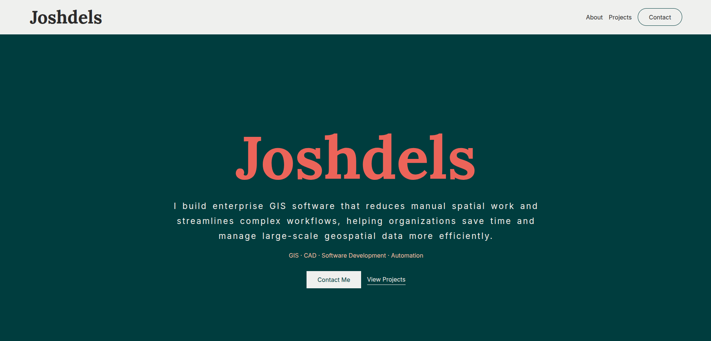

# My Portfolio

A personal portfolio built with Django and Wagtail to showcase my projects, technical work, and project history.





## Stack

* Django
* Wagtail
* PostgreSQL
* HTML / CSS / JavaScript
* Docker

## Features

* Wagtail-managed homepage
* Project portfolio and project history
* Contact inquiry form with email notifications
* Responsive frontend
* Dockerized deployment
* Automated CI/CD with GitHub Actions

## CI/CD

The project uses GitHub Actions for automated builds and deployment.

### Build

Every push and pull request targeting `main` builds the Docker image to verify that the application can be containerized successfully.

### Deploy

Every push to `main` triggers deployment to the production server through SSH.

The deployment:

1. Updates the server repository to the latest `main`.
2. Builds the Docker image.
3. Starts the application with Docker Compose.
4. Removes unused Docker images, containers, and volumes.

The workflows are located in:

```text
.github/
└── workflows/
    ├── build.yml
    └── deploy.yml
```

## Documentation

* [Installation](docs/installation.md)
* [Architecture](docs/architecture.md)

## Development

```bash
python manage.py migrate
python manage.py createsuperuser
python manage.py runserver
```

Wagtail admin:

```text
http://127.0.0.1:8000/admin/
```
